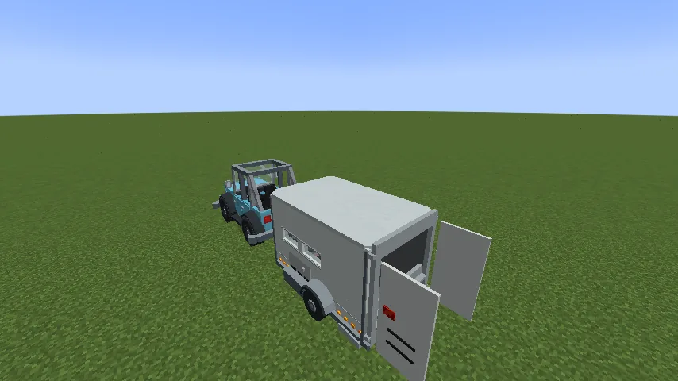
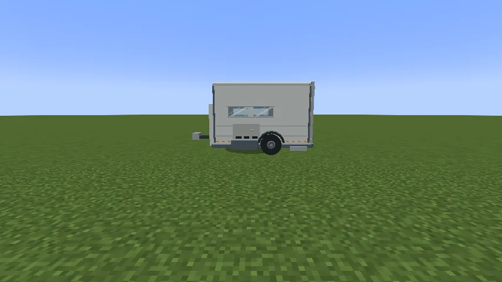
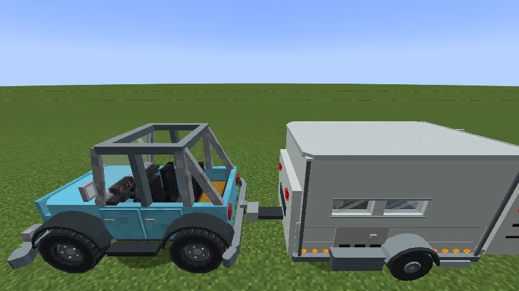
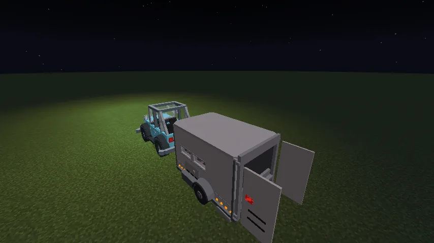
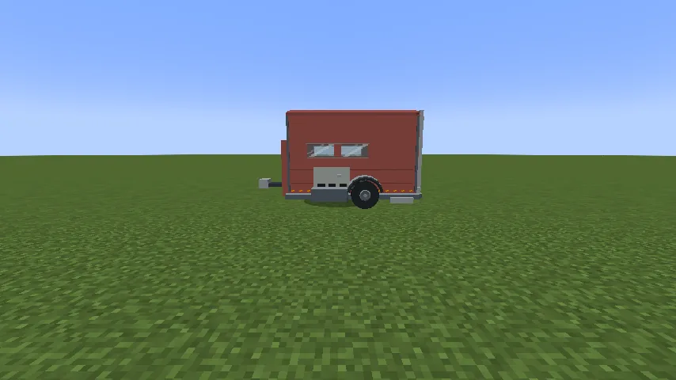

The **Trailer** is a livestock trailer. It hitches behind any vehicle with a rear hitch (the
[Trailblazer](/wiki/trailblazer) and the [Farmer's Pickup](/wiki/farmers-pickup) both have one)
and follows through turns the way a real trailer does. It has room for **four grown animals or
eight young ones** behind double rear doors, windows to see them through, and amber marker lamps
along the rails that come on with the car's headlights. Towing, loading and repairs are
[Vanilla Wheels](/wiki/vanilla-wheels)'s, so read that page too.

## Getting one

1. **The chassis:** six steel blocks and three iron bars, in this grid:

   | | | |
   |---|---|---|
   | steel block | iron bars | steel block |
   | steel block | steel block | steel block |
   | iron bars | iron bars | iron bars |

2. **Build it** on a **Mechanic Lift** with the chassis and **two wheels**. No engine. It comes
   out white; put a dye in the lift and press **Paint** to colour it.

## Hitching it

- **Hold the trailer item and right-click a vehicle** with a free rear hitch: it's put down
  already hitched.
- Or **back the vehicle's hitch** up to a loose trailer's tongue while moving, and it catches.
- **Crouch and right-click the tongue** to unhitch; it rolls back a little, clear of the ball.

## Loading animals

1. **Open the doors:** crouch and right-click a rear door, empty-handed. Both open (the same
   click shuts them).
2. **Load:** right-click the trailer **holding a lead, or with an empty hand**. Every animal on
   your leads within ten blocks boards, nearest first, while there's room, and the leads come
   back to you. A grown animal takes a whole place and a young one half: four cows, eight calves,
   or two cows and four calves.
3. **Unload:** with the doors open, crouch and right-click the trailer **holding a lead**. They
   step out behind.

Animals never board through shut doors, and nobody walks through the trailer's body.
[Serfdom](/wiki/serfdom)'s villagers in chains ride the same way.

## Good to know

| | |
|---|---|
| Size | 2.35 blocks wide, 5.18 long, 2.79 high |
| Climbs | one-block steps |
| Garage door | needs one four blocks high |
| Lamps | come on with the towing car's headlights (**H**) |
| Repair by hand | 3 food points of hunger for a full rebuild |
| Repair on the Mechanic Lift | 12 steel ingots for a full repair |

Trailers can tow trailers.

